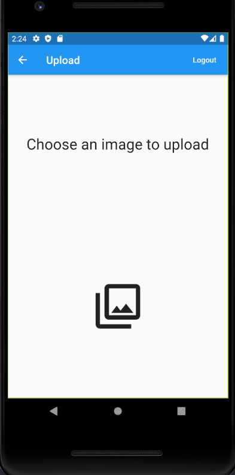

# Epicture

## Project
Epicture is a mobile application that allows you to access certain features of your imgur account.
- Imgur API implementation
- Authenticate to the Imgur platform
- Display the photos put online by the user connected
- Search for photos on the plateform
- Upload photos to the plateform
- Manage your favorites
- Filter the displayed photos

This project was a 3rd year EPITECH project and it was made by :
- Adrian HOARAU (adrian.hoarau@epitech.eu)
- Arthur BERTAUD (arthur.bertaud@epitech.eu)

## Flutter

Our project is powered by Flutter.
- To build the project you must have an `android-x86` telephone emulator or a android telephone plugged to your computer.
- You eventually might want to run `flutter pub get && flutter pub upgrade` beforehand to get packages needed by the project 
- Then you must run the command `flutter run` in the terminal at projet root to run the app on your telephone/emulator.

If you're willing to test our project, you might want to run `flutter test test/user_methods_test.dart`.

## User Documentation
### Login Phase

Once you've launched the application, the only thing you can is either login or leave the application.

If you've decided to login, you'll have access to the imgur's login portal, so feel free to enter your login details.
Note that we'll not have access to your details.

### Menu

Once you've authenticated, you'll arrive on the menu. It's pretty simple, you've choice between few functionalities:
- Gallery
- Favorites
- Search
- Upload

### Gallery

The gallery corresponds to your own feed, you'll be able to see all the publications you've uploaded. You also can add in favorite an image with a simple double-click on the image of your choice.

### Favorites

The Favorites section gather all the images you've put in favorite.

### Search

Type something you're looking for, and our search functionality will let you watch all the images corresponding.

### Upload

Once you've clicked on the upload button, you're free to select an image from your photos or drive. After that, You'll be able to see this image in your gallery.

### Logout

When you're done with the application, feel free to logout with the option on the upper right and comeback a next time.
